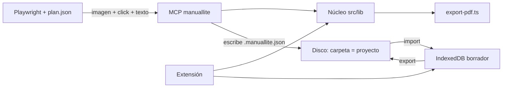

# Arquitectura — ManualLite v2

Paradigma: **núcleo compartido, dos frentes, un objeto**. El núcleo define el manual. La extensión graba. El MCP crea y corrige. El disco es la biblioteca. Playwright queda fuera.

## Diagrama



## Invariantes

**AD-1 Núcleo Node-safe en `src/lib`.** Binds: formato, parse/serialize, modelo de pasos, geometría del anillo, exporters (PDF/HTML/Markdown). Prevents: `mcp-server/src/schema.ts` como espejo; scripts que armen el JSON a mano. Rule: extensión, MCP y `scripts/export-pdf.ts` importan esa superficie. I/O de navegador (`IndexedDB`, `downloadBlob`, `File`, `OffscreenCanvas`, `createImageBitmap`) no vive ahí.

**AD-2 Dos frentes, cero orquestadores de browser en producto.** Binds: extensión = humano (side panel + editor); MCP = agente (crear y corregir archivos). Prevents: extensión lanzando Playwright; MCP navegando; un tercer canal de creación. Rule: capturar en el MCP significa *aceptar* una captura ya tomada.

**AD-3 Disco es biblioteca; IndexedDB es borrador.** Binds: un proyecto es un directorio; un manual es un `.manuallite.json` dentro. Prevents: carpetas o procedencia como modelo de IndexedDB; el editor como file manager. Rule: no hay raíz mágica — quien llama elige el directorio.

**AD-4 Un objeto.** Binds: el archivo que escribe el MCP es el mismo `ProjectFile` que exporta la extensión. Prevents: un formato "agent" paralelo. Rule: import actual abre un manual de agente; export actual escribe un manual humano al disco.

**AD-5 PDF.** Binds: camino headless = `scripts/export-pdf.ts` → `pdf.ts` → `pdfLayout.ts`. Prevents: segundo builder de PDF; tocar `pdfLayout.ts`.

**AD-6 Captura humana.** Binds: el pipeline del side panel no se reabre. Prevents: volver el badge al DOM fotografiado u otra técnica de `captureVisibleTab`.

**AD-7 Anotación: geometría compartida, dos backends.** Binds: una función de anillo recibe un `CanvasRenderingContext2D` y concentra radios, halo, trazos y colores. Extensión: `OffscreenCanvas` + `createImageBitmap` (como hoy, service worker). MCP: `@napi-rs/canvas` 1.0.9, verificado en Bun 1.3.14 con `bun run`. Prevents: llamar `annotate.ts` tal cual desde Bun; polyfill de `OffscreenCanvas` / `createImageBitmap` / `ImageBitmap`; `@napi-rs/canvas` en la extensión (el SW no carga addons N-API); reimplementar el anillo en el MCP. Rule: paridad **visual**, no byte a byte. En la caja del halo, media ≈ 0.71 por canal (antialias Skia vs Chrome); la línea central del anillo es `#dc2626` idéntica. Se acepta.

## Procedencia

En el `ProjectFile`, objeto opcional (archivos sin él siguen siendo válidos):

```
provenance?: {
  producedBy: "human" | "agent"
  producedAt: number   // epoch ms, producción del manual
  origin?: string      // libre, lado agente: plan, script, skill…
}
```

- Es de **producción**, no de edición. `write_corrected_manual` y el editor no cambian `producedBy`.
- No va por paso. `Step.createdAt` sigue siendo el timestamp vivo del paso; no es procedencia de biblioteca.
- Ausente = desconocida (entregas actuales). La biblioteca no infiere `human`.
- Export humano nuevo escribe `producedBy: "human"` y `producedAt`. Armado MCP escribe `producedBy: "agent"`, `producedAt` y `origin` si el llamador lo da.
- `formatVersion` permanece en 1.

## MCP — lado crear

Se añaden operaciones al servidor existente (`mcp-server/`), no un servidor nuevo. Las de revisión se conservan.

| Operación | Hace |
|---|---|
| Crear / abrir armado | Alta de un manual en memoria o archivo, con procedencia `agent`. |
| Añadir paso | Recibe caption, descripción, url, click, imagen (y kind si aplica). |
| Anotar | Dibuja el anillo con la función compartida sobre un canvas de `@napi-rs/canvas`. Paridad visual con la extensión, no PNG idéntico. |
| Persistir | Escribe `.manuallite.json` en el directorio de proyecto. |

Nombres concretos de tools: seed. Listar puede seguir recibiendo `dir`; si el `dir` es un árbol de proyectos, la lista debe poder agrupar por carpeta.

## Brownfield

- `src/lib/project.ts` mezcla esquema + download/import-a-IDB. Hay que partir: parse/serialize en la superficie Node-safe; download/import se quedan en la extensión.
- `mcp-server/src/schema.ts` declara ser espejo de `ProjectFile`. Ese espejo desaparece cuando el MCP importa el núcleo.
- `annotate.ts` usa `OffscreenCanvas` y `createImageBitmap`. En Bun 1.3.14 no existen (tampoco `ImageBitmap`). Extraer la geometría del anillo a una función que recibe `CanvasRenderingContext2D`; `annotate.ts` solo crea el canvas del SW y la llama. El MCP hace `loadImage` + `createCanvas` + la misma función + `encode('png')`. `Bun.Image` no dibuja: no sirve de backend.
- `export-pdf.ts` ya importa `src/lib/exporters/pdf`. Ese patrón es el del núcleo.
- IndexedDB (`src/db/index.ts`) es lista plana de manuals/steps. No se le añaden carpetas.

## Deferred

- Nombres finales de las tools de creación y si `list_manuals` recorre subdirectorios o recibe el proyecto ya elegido.
- Extraer `packages/core` como workspace; no hace falta si `src/lib` Node-safe basta para que el MCP importe.
- Mostrar procedencia en el editor (prohibido rediseñarlo; round-trip al reexportar sí es obligatorio).
